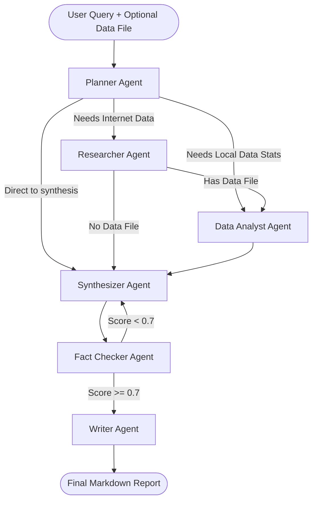

# 🚀 Agentic AI System — Deep Dive & Technical Walkthrough

Welcome to the **Agentic AI System**! This document is your comprehensive guide to understanding what this project is, how it works, why it was built this way, and how you can run and extend it.

---

## 📖 1. What is this Project?

This project is a **Production-Grade Multi-Agent AI System**. Instead of having one single AI chatbot try to answer all your questions, this system uses a "team" of specialized AI agents. They collaborate to solve complex queries, just like a real corporate team. 

To make it truly modern and interoperable, it uses three major technologies:
1. **LangGraph**: A framework that manages the "workflow" and routes tasks between agents using a state machine.
2. **Model Context Protocol (MCP)**: A standard for connecting AI models to external tools (like Web Search or Data Analysis) securely and reliably.
3. **Agent-to-Agent (A2A) Protocol**: A standard that allows this entire AI system to be exposed as a microservice so *other* AI systems or enterprise applications can discover it and assign it tasks.

---

## 🎯 2. Primary Use Cases

Why would you use this instead of just asking ChatGPT?

- **Automated Market Research**: You can ask it to "Find the latest trends in Quantum Computing." The Planner will realize it needs the **Researcher Agent**, which will use the MCP Web Search tool to browse the live internet, read articles, and then the Synthesizer and Writer will format it into a beautiful Markdown report.
- **Hands-Free Data Analysis**: You can upload a raw `.csv` or `.xlsx` file (e.g., `sales_data.csv`) and say "Tell me why our Q3 sales dropped." The **Data Analyst Agent** will use the MCP Data Analysis server to safely compute statistics using `pandas`, find the anomalies, and the LLM will generate business insights from those statistics.
- **Combined Intelligence**: You can give it a dataset and ask it to compare it to the real world. (e.g., "Analyze this startup funding data and research what caused the 2023 dip"). It will route to *both* the Data Analyst and Researcher, combining their findings into one executive report.
- **Microservice Integration**: Because of the A2A server, you can deploy this on a server, and a completely different software platform (like an automated CRM) can ping `http://your-server/a2a/tasks/send` to automatically trigger research jobs in the background.

---

## 🏗️ 3. System Architecture

The workflow is driven by **LangGraph**. Here is a visualization of the state machine:



### The Component Breakdown

#### A. The Agents (`src/agents/`)
- `base_v2.py`: The core building block. Connects to Groq to run the LLM (like Llama 3) incredibly fast.
- `planner.py`: The manager. It reads the user prompt and decides the step-by-step plan.
- `researcher.py`: The researcher. It generates search terms and pings the MCP web server to scrape the internet.
- `data_analyst.py`: The data scientist. It pings the MCP data server to analyze datasets mathematically.
- `synthesizer.py`: The editor. It takes the messy notes from the researcher and data analyst and merges them.
- `fact_checker.py`: The quality assurance auditor. It strictly reviews the synthesized notes against the raw data to ensure there are no hallucinations or factual errors, forcing rewrites if the score is low.
- `writer.py`: The publisher. It turns the synthesized notes into a clean, professional Markdown report.

#### B. The MCP Tool Servers (`src/mcp_servers/` & `src/mcp_client/`)
Instead of letting the LLM directly run code, we isolate tools into **MCP Servers**. 
- `web_search_server.py`: Wraps DuckDuckGo internet searching.
- `data_analysis_server.py`: Wraps Pandas DataFrame analysis.
- `tool_client.py`: The bridge that allows the agents to call these servers securely via `stdio` (standard input/output streams).

#### C. The A2A API Server (`src/a2a/`)
- `agent_card.py`: The metadata profile. It tells the world: "I am a multi-agent system, I can do research and data analysis."
- `a2a_server.py`: A robust **FastAPI** web server. It turns the LangGraph workflow into an API endpoint (`/a2a/tasks/send`) so it can be controlled remotely.

---

## ⚙️ 4. How to Run the Project

### Prerequisites
Make sure you have installed the requirements and set your API key in your terminal:
```bash
# Windows
set GROQ_API_KEY=your_actual_groq_api_key_here
```

### Mode 1: Run via the Command Line Interface (CLI)
If you just want to run it from your terminal manually:
```bash
python main.py
```
*The CLI will ask you for a prompt and optionally the path to a dataset file. It will then run the LangGraph workflow locally in your console.*

### Mode 2: Run as a Distributed Microservice (A2A)
If you want to run this as an API that can be called by other apps:

**Step 1: Start the Server**
Open your terminal and run:
```bash
python run_a2a_server.py
```
*This starts a server on `http://localhost:8000`. It exposes the `/.well-known/agent.json` discovery endpoint.*

**Step 2: Trigger a Task (in a new terminal)**
Open a second terminal window and run:
```bash
python src/a2a/a2a_client.py
```
*This simulates a third-party application sending a job to your AI system via a standard JSON-RPC network request.*

### Mode 3: Running Tests
To ensure everything works perfectly:
```bash
# Run unit tests (doesn't hit the API)
pytest tests/test_workflow.py -v -m "not integration"
```

---

## 🔍 5. Deep Dive Example: Tracing a Request

Imagine you start the A2A server and send this request via the client:
**"Analyze the AI adoption dataset and research why adoption skyrocketed in 2023."**

1. **A2A Server**: Receives the request at `/a2a/tasks/send` and initializes `AgentState`.
2. **Planner**: Groq LLM analyzes the prompt. It realizes it needs BOTH internet research ("research why...") and data analysis ("analyze the AI adoption dataset"). It routes to the `Researcher`.
3. **Researcher**: The agent queries Groq to create 3 search terms. It uses the `MCPClient` to quietly launch the `web_search_server.py` process, fetch Bing/DuckDuckGo results, and store the text in `state["research_findings"]`. It routes to `DataAnalyst`.
4. **DataAnalyst**: Uses the `MCPClient` to launch `data_analysis_server.py`. It calculates the mean, max, and missing values of the CSV. The LLM then looks at those stats to formulate `state["analysis_insights"]`. It routes to `Synthesizer`.
5. **Synthesizer**: Combines the internet findings and the data findings into a single, cohesive narrative. It routes to `FactChecker`.
6. **FactChecker**: Compares the Synthesizer's narrative with the original raw findings. It scores the report. If the score is `< 0.7`, it sets `needs_revision=True` and bounces the workflow back to the Synthesizer. If valid, it routes to `Writer`.
7. **Writer**: Applies Markdown formatting, adds headers and a footer. It sets `next_agent = None` which signals the end of the graph.
8. **A2A Server**: Returns the final string back to your terminal via the API response.

This architecture ensures your AI system is decoupled, testable, and scales beautifully for enterprise use cases!
