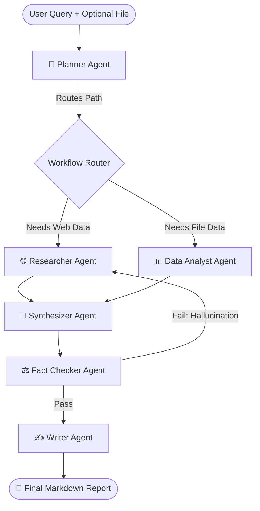

# 🤖 Multi-Agent AI Research Assistant

<div align="center">
  
  [](#)
  [](#)
  [](#)
  [](#)
  [](#)

  **An autonomous, production-deployed AI system. Ask complex questions, analyze datasets, and get comprehensive, fact-checked reports — powered by 6 specialized AI agents.**

  🚀 **[Live Demo](https://multi-agent-ai-research-assistant.vercel.app/)** • ⚙️ **[Backend API](https://multi-agent-ai-research-assistant-production.up.railway.app/docs)**

</div>

---

## 📌 What is the Multi-Agent Research Assistant?

This project is a production-grade **Multi-Agent Architecture** built with LangGraph and LLaMA 3. Unlike a standard ChatGPT prompt, this system automatically spins up a team of specialized AI agents that collaborate to solve your query. They browse the internet in real-time, analyze CSV/Excel files using pandas, synthesize findings, logically verify the facts, and output a professional markdown report.

⚠️ **Note:** The backend is hosted on a free Railway tier and may take 30-60 seconds to wake up if it has been idle.And currently adding new features so that we can also upload pdf files.

---

## ✨ Key Features

| Feature | Description |
| :--- | :--- |
| **🌐 Web Research** | Real-time internet access via DuckDuckGo to pull live data. |
| **📊 Data Analysis** | Upload CSV/Excel files and let the Data Analyst agent run statistical checks via pandas. |
| **🤖 6-Agent Pipeline** | Dedicated agents for Planning, Research, Analysis, Synthesis, Fact-Checking, and Writing. |
| **⚡ Ultra-Fast Inference** | Powered by the Groq API (Llama 3 70B), delivering 500+ tokens per second. |
| **🔄 Auto-Correction Loop** | The FactChecker agent reviews the report and forces rewrites if it detects hallucinations. |
| **🔌 MCP Integration** | Implements the **Model Context Protocol (MCP)** and **Agent-to-Agent (A2A)** JSON-RPC specs. |
| **🐳 Dockerized** | Fully containerized with Docker Compose for seamless environment replication. |

---

## 🏗️ Architecture & Workflow

The system utilizes a directed acyclic graph (DAG) via **LangGraph** to route the workflow between agents intelligently.



### Agent Roles & Temperature Profiles

| Agent | Model Temp | Primary Role |
|-------|-----------|------|
| **Planner** | `0.3` (Precise) | Analyzes query, creates execution plan, routes to necessary agents. |
| **Researcher** | `0.5` (Balanced) | Executes DuckDuckGo queries, reads web pages, extracts context. |
| **Data Analyst** | `0.3` (Precise) | Writes and executes Python pandas code to extract stats from files. |
| **Synthesizer** | `0.6` (Creative) | Merges disparate data points into cohesive, logical insights. |
| **FactChecker** | `0.1` (Strict) | Adversarial QA loop. Flags logical leaps or missing citations. |
| **Writer** | `0.5` (Balanced) | Formats the final output into a professional, readable Markdown report. |

---

## 🚀 Installation & Local Development

### Prerequisites
- Python 3.11+
- Node.js 20+
- Free [Groq API Key](https://console.groq.com)

### 1. Backend Setup (FastAPI & LangGraph)

```bash
# Clone the repository
git clone https://github.com/KunjanMinama/Multi-Agent-AI-Research-Assistant-.git
cd "Multi-Agent-AI-Research-Assistant-"

# Create Virtual Environment & Install Dependencies
python -m venv venv
source venv/bin/activate  # On Windows: venv\Scripts\activate
pip install -r requirements.txt

# Add your API keys
echo "GROQ_API_KEY=gsk_your_key_here" > .env

# Run the FastAPI Server
uvicorn main:app --reload --port 8000
```

### 2. Frontend Setup (React & Vite)

```bash
# Open a new terminal and navigate to frontend
cd frontend

# Install dependencies
npm install

# Start the dev server
npm run dev
```

---

## 🐳 Docker Deployment

To run the entire full-stack application (Backend + Frontend + Nginx) locally via Docker:

```bash
# Build and start the containers
docker-compose up --build
```
* The React frontend will be available at `http://localhost:3000`
* The FastAPI backend will run on `http://localhost:8000`

---

## 💻 CLI Usage

You can also bypass the frontend and run the system directly from the terminal:

```bash
# Basic Research
python cli.py "What are the latest breakthroughs in Quantum Computing?"

# Research with File Analysis
python cli.py "Analyze these survey results and find the top 3 trends" --data survey.csv

# Save Output to File
python cli.py "History of AI" --output reports/history.md
```

---

## 🧪 Testing Pipeline

The backend includes a comprehensive `pytest` suite for unit and integration testing. CI/CD automatically runs these tests on every push.

```bash
# Run unit tests (Mocked LLM, no API key needed)
pytest tests/ -v -m "not integration"

# Run integration tests (Hits real Groq endpoints, requires API key)
pytest tests/ -v -m integration
```

---

## 📄 License

This project is licensed under the MIT License — free for personal, educational, and commercial use.

## 👨‍💻 Author

**Kunjan Minama**

[](https://www.linkedin.com/in/kunjan-minama-1b023b342/)
[](https://github.com/KunjanMinama)

---

<div align="center">
⭐ Star this repo if you found it helpful!
</div>
